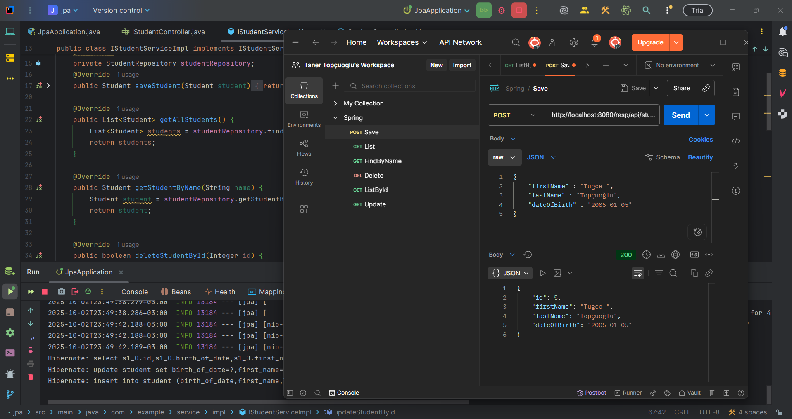

# Spring Boot Student Management API

Bu proje, **Spring Boot** kullanılarak geliştirilmiş temel bir **Student Management (Öğrenci Yönetimi) servisi**dir. CRUD (Create, Read, Update, Delete) operasyonlarını REST API üzerinden gerçekleştirmeye yönelik bir örnek uygulamadır.

---

## Özellikler

- **Student CRUD operasyonları**
  - `Create`: Yeni öğrenci ekleme
  - `Read`: Öğrenci bilgilerini id ile çekme
  - `Update`: Var olan öğrenciyi güncelleme
  - `Delete`: Var olan öğrenciyi silme
- **Spring Data JPA** ile veritabanı işlemleri
- Basit **REST API** endpoint’leri
- Hata yönetimi: Geçersiz ID veya bulunmayan entity için exception handling

---

## Kullanılan Teknolojiler

- Java 17+
- Spring Boot 3.x
- Spring Data JPA
- H2 / MySQL / PostgreSQL (opsiyonel)
- Maven

---

## API Endpoint’leri

| HTTP Metodu | URL                       | Açıklama                   |
|------------|---------------------------|---------------------------|
| POST       | `/api/student`            | Yeni öğrenci ekler        |
| GET        | `/api/student/{id}`       | ID’ye göre öğrenci getirir |
| PUT        | `/api/student/update/{id}`| ID’ye göre öğrenci günceller |
| DELETE     | `/api/student/delete/{id}`| ID’ye göre öğrenci siler  |

---

## Örnek JSON Gövdesi (Request Body)

```json
{
  "firstName": "Taner",
  "lastName": "Topçuoğlu",
  "dateOfBirth": "2000-05-15"
}

 
